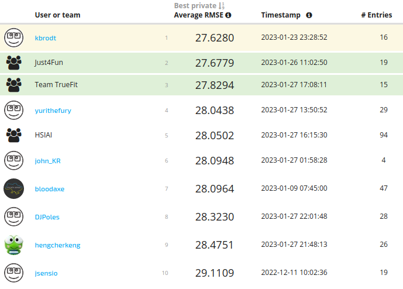

# The BioMassters

[The
BioMassters](https://www.drivendata.org/competitions/99/biomass-estimation/page/534/)

[1st
place](https://www.drivendata.org/competitions/99/biomass-estimation/leaderboard/)
out of 976 participants with 27.6280 Average RMSE score (top2 27.6779).



## Approach

The solution is based on an UNet model with a shared encoder with aggregation
via attention. The inputs to the encoder are 15-band images with a resolution
of 256x256 from joint Sentinel-1 and Sentinel-2 satellite missions. The encoder
is shared for all 12 months. The outputs are aggregated via self-attention.
Finally, a decoder takes as inputs the aggregated features and predicts a
single yearly agbm. We directly optimize `RMSE` using `AdamW` optimizer and
`CosineAnnelingLR` scheduler. We don't compute loss for high agbm values
(>400). We use vertical flips, rotations, and random month dropout as
augmentations. Month dropout simply removes images.

## Highlights

- UNet model
  * Shared `tf_efficientnetv2_l_in21k` encoder for all months. The input is
    15-band images with min-max normalization. Aggregate over all 12 months via
    self-attention at the encoder level
  * Heavy decoder takes aggregated features and predicts single yearly agbm
- `RMSE` loss (ignore high values >400)
- Train 900 epochs on one split (fold), then finetune 200 epochs on full
  dataset, 8 batch size per GPU, mixed precision
  * `AdamW` optimizer with `1e-3` learning rate and `1e-2` weight decay
  * `CosineAnnealingLR` scheduler
- Augmentations: random flips, rotations, and month dropout
- Test time augmentations: left-right and up-down flips

## Prerequisites & Hardware

- GNU/Linux
- [Python 3](https://www.python.org/)
- Nvidia Driver Version: 515.65.01
- CUDA Version: 11.7
- [PyTorch 1.13](https://pytorch.org/)
- 2 x GPU Nvidia A100 40GB VRAM
- 4 x CPU AMD Milan 7413 @ 2.65 GHz 128M cache L3
- 64GB RAM
- 8 days for training
- 5 min for inference

## Setup

Create an environment using Python 3.8. The solution was originally run on
Python 3.8.10. Install the required Python packages

```bash
pip install -r requirements.txt
```

Download the data from the competition page and unzip into `data` folder.

### Training

To run training from the command line

```bash
sh ./run.sh
```

It will take about 8 days on 2 A100 40GB GPUs.

### Inference

Download [pretrained](https://disk.yandex.ru/d/01YXhPyiKZifYw) models and
extract into `models` folder.

```bash
unzip models.zip -d models
```

To run inference from the command line

```bash
sh ./submit.sh
```

It takes ~5 minutes on 1 GPU A100 40GB (note on V100 32GB the results are
slightly different).
